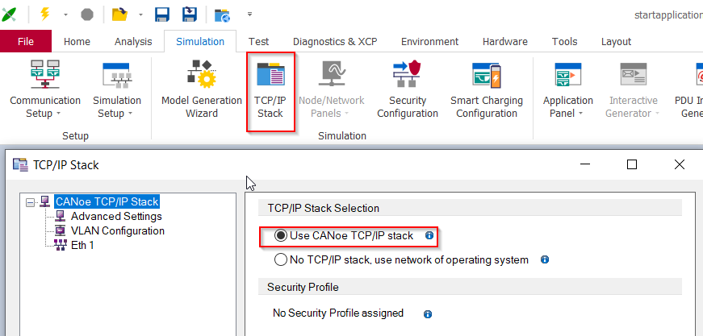
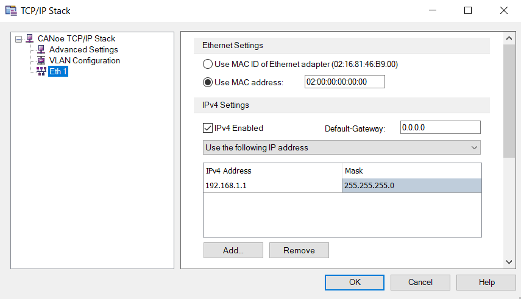
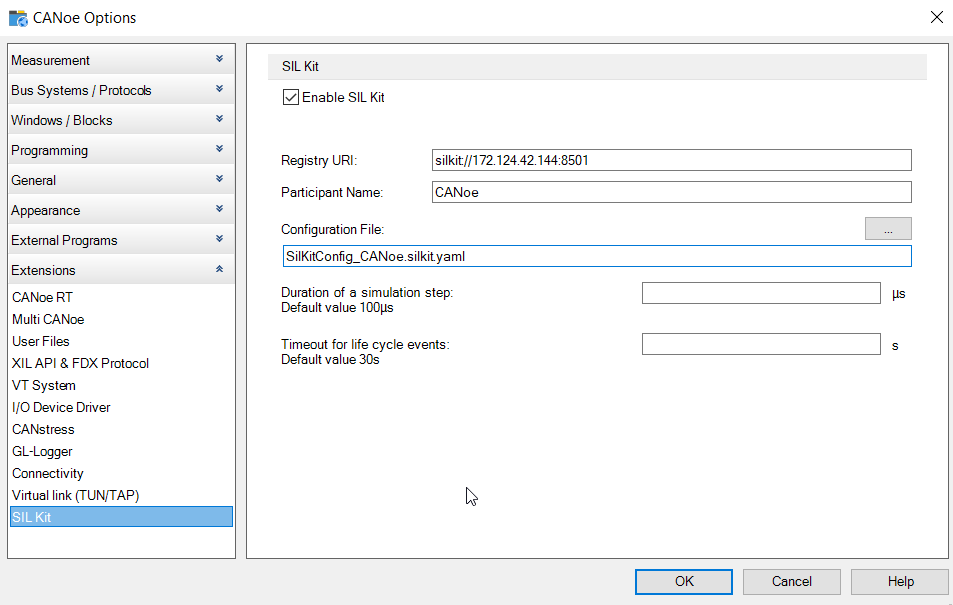
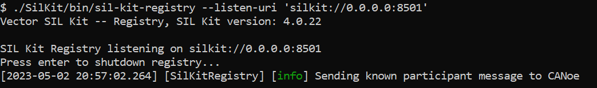
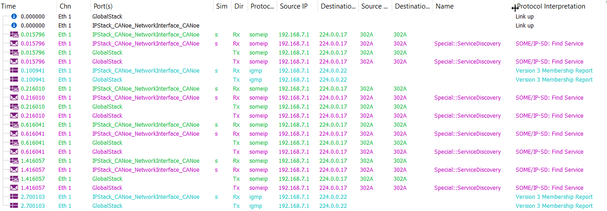
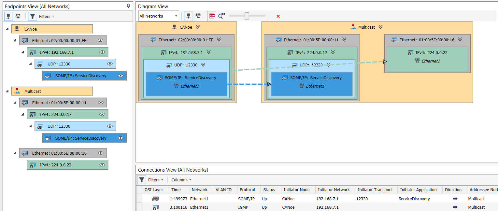
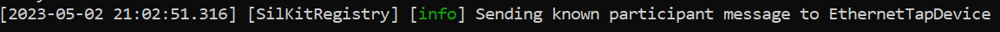

# From MICROSAR Adaptive delivery to simulation with CANoe

This document will guide you how to use CANoe as a test tool for an adaptive application, that is built based on a MICROSAR Adaptive BSW package. A MICROSAR Adaptive delivery contains some examples. We will use the start application, connect it to CANoe and simulate parts of it with CANoe's toolbox. These instructions are written based on an Adaptive MICROSAR stack version r5.22 and CANoe 17. With every newer release of the Adaptive stack or CANoe, there might be deviations from this guide, though it shall be possible to adapt the commands with the user guides provided with the tools.  
The start application contains one adaptive machine with multiple executables. It does not realize an automotive user story, but uses all relevant parts of an adaptive application with comprehensive names. It consists of the following use cases:

- Communication Management (StartApplicationCmClient1 and StartApplicationCmServer1)
- Diagnostics (Diagnostic Manager and Tester)
- Signal2Service (StartApplicationS2sApp1 and StartApplicationS2sApp2)  
- Persistency (StartApplicationPerApp1)

It relies on the SomeIP Daemon that is part of the delivery. Communication in between the executables is realized with SomeIP and IPC. The original startapplication may use the execution manager and also contains some python scripts to trigger the single executables.
We will use a VM Ware VM for building the stack and for running the adaptive executables. Any other virtualization platform may be used as long as it is suitable to build the Adaptive stack. CANoe will be connected to the VM using the Vector SIL Kit and the Vector SIL Kit Adapters TAP.  

## Build the Adaptive MICROSAR stack

After decrypting and unpacking the adaptive delivery use the manual Doc/UserManuals/InstallationGuide_MICROSARAdaptive.pdf to get the latest requirements and instructions to set up your Linux system. Install all tools mentioned in the Installation / Prerequisites section. This guide is based on r5.22 and we use a VMWare VM with Ubuntu 20.04. For building the components of the stack, we use the TACO system and follow the given instructions to build the stack with its examples and install all built components.  
The  *InstallationGuide_MICROSARAdaptive.pdf* will contain a more detailed explanation. In short, the SIP needs to be built and installed, which may look like this:

1. Initialize CMake in the SIP directory

```bash
cmake -C CMakeConfig/linux_gcc7.cmake -S . --preset=gcc7_linux_ x86_64
```

2. Proceeded with building the stack

```bash
cmake --build build/gcc7_linux_x86_64 --target all --parallel $(nproc)
```

3. At the end the built package is installed

```bash
cmake --install build/gcc7_linux_x86_64 --component AMSR_Runtime - -prefix build/install/gcc7_linux_x86_64
```

## Set up the SIL Kit Adapters infrastructure

Download a preview or release of the Adapters directly from [Vector SIL Kit Adapters Releases](https://github.com/vectorgrp/sil-kit-adapters-tap/releases) or build the Vector SIL Kit Adapters TAP [on your own](https://github1.vg.vector.int/pnd/sil-kit-adapters-tap#a-getting-started-with-self-build-adapters-and-demos).

For both options you need a sil-kit-registry contained in the SIL Kit Release, which you can download directly from [Vector SIL Kit Releases](https://github.com/vectorgrp/sil-kit/releases).

## Create CANoe configuration

Create a new CANoe configuration based on the template `Ethernet (Communication Setup)`.  

An adaptive application usually has multiple ARXML files, CANoe's AUTOSAR Preprocessor allows you to merge these ARXML files.


The combined system descriptions (ARXML) can be added in the communication setup ("System and Communication Setup" -> "Load an existing data source"). This will configure the network setup and generate communication objects, allowing you to test the available services. You will get an overview about the generated communication objects and derived participants in the "Communication Setup".


Enter the TCP/IP Stack configuration from the simulation tab and enable to use "CANoe TCP/IP stack", enable to use a specific MAC address and activate IPv4 and assign a suitable IP address.




### Configuration of the SIL Kit

Enable the SIL Kit in CANoe by entering the global options / "Extensions" / "SIL Kit" and select "Enable SIL Kit".

1. **Registry URI**: Set the IP address and port to the values of the system where the sil-kit-registry is running. In our example we run the sil-kit-registry on the Linux system, where the adaptive application is executed.

2. **Participant Name**: This name is the identifier of CANoe in the context of SIL Kit communication.  

3. **Configuration File**: For our first example the name of the network in CANoe ("Ethernet1") equals the name of the SIL Kit network that is passed to the Vector SIL Kit Adapters TAP. Therefore we do not need to specify a configuration file because both participants will be in the same SIL Kit network by default.

      

### Advanced configuration of the SIL Kit

If you want or have to use a different network name in CANoe and the SIL Kit, a configuration file is required. This is not necessary if the name of the network that is passed to the Vector SIL Kit Adapters TAP equals the name of the network in CANoe.  

To use a custom network for the interaction, create a new YAML file containing the configuration of the SIL Kit for CANoe.



In this file, the option "EthernetControllers" with the attributes "Name" and "Network" needs to be defined:

```YAML
Description: Configuration for CANoe participant for Vector SIL Kit Adapters TAP port of calculator demo
EthernetControllers:
- Name: "Ethernet1/IPStack_CANoe_NetworkInterface_CANoe"
  Network: "silkit_network"
```

**Important**: The name of the controllers must match the pattern "EthNetworkName/SimulationPortName" in CANoe. To check the names of the controllers, go to the "Hardware" tab in CANoe. Then select "Port Configuration".  The value given at "Network" needs to match the network name which has been set for Vector SIL Kit Adapters TAP as well.


### Select the Simulation Mode

In a last configuration step, the simulation and channel settings need to be adapted in CANoe. First change the simulation mode to "Real Bus".

  

Now switch to the "Hardware" tab and click on "Channel Mapping". In this window one Ethernet channel should be shown. In the dropdown menu for the option "Hardware" set the value to SIL Kit.

  

## Testing the server - CANoe as client

In a first step we run the server executable in the Linux system and use CANoe as a client. As previously described, combine all system descriptions besides those of the client with the AUTOSAR preprocessor and add the combined ARXMLs in the Communication Setup.
CANoe will derive a participant as application layer object for the executable defined in the ARXML. This participant builds the server, which is executed on the Linux system as real device. It consists of multiple communication objects (COs); a communication object will be derived for every service interface and allows accessing events, fields, methods and PDUs. As CANoe will build the counterpart to the real device, automatically another application layer participant `CANoe` is derived.

Depending on the amount of ARXMLs that were added and their contained service interfaces, additional communication objects may have been derived.  

- Set the state of communication objects that are not needed for the moment, e.g. the Diagnostic Service Interface, to `Off`.
- Set the state of the participant CANoe to `On/Simulated (CANoe)` and enable to generate the C# API, since we will write a C# test.  
- The state of the participant running in the Linux system shall be set to `Real (Device)` - in our example this is the participant ``StartApplicationMachineDesign``.

      
    
      

A first test could consist of checking the availability of the service provided by the server application and test if the `StartApplicationMethod1` works correctly:

```csharp
  [TestCase("TestClientMethod")]
  private void TestClientMethod()
  {
    Report.TestCaseDescription("Check valid operation of service method \"Add\"");
    
    for(uint number = 201; number < 210; number++)
    {
      Report.TestStep("INVOKE_METHOD", "Transmit request to server provider: StartApplicationMethod1" + number.ToString());
      StartApplicationMethod1_prototype_Base.CallContext call_handle;
      call_handle = NetworkDB.ProvidedSomeipStartApplicationCmService1_ServiceInterface.consumerSide.StartApplicationMethod1.CallAsync(number);
      // Wait until result received or timeout
      if (Execution.WaitForAnswer(call_handle, 1000).WaitResult == 1)
      {
        Report.TestStepPass("CHECK_RESULT", "Received response from server");
        uint received_value = call_handle.output_argument;
        uint expected_value = number + 1;
        // Compare received result to expected value
        if (received_value == expected_value)
        {
          Report.TestStepPass("CHECK_RESULT", "Expected return value received: " + call_handle.output_argument.ToString());
        }
        //[...]
      }
    }
  }
```

CANoe is configured and in the next section we will prepare the Vector SIL Kit Adapters TAP in the Linux system.

## Build the start application

The start application is part of the delivery at Examples/startapplication. It comes with its own user manual *Doc/UserManuals/UserManual_StartApplication.pdf*. Besides a description of all single components of the start application it contains instructions on how to build and install the start application with TACO. Follow these instructions and end after the section *Install Runtime*. We won't create a network adapter for the start application as the next step of the user guide suggests, since we want to connect it to CANoe.

## Run the simulation

This sketch shows the components of our setup and how they are connected:

    +----------------------------+
    |                            |
    |           Server           |
    |       IP 192.168.7.2       |
    |         Port:31404         |
    |                            |
    +----------------------------+
                  <=>
                 NetNS
                  <=>
    +-----[ SomeIP Daemon]-------+                                            +------[ SIL Kit Adapter TAP ]------+
    |  silkit_tap added to NetNs | <= ----------- silkit_tap -------------=>  |  TapConnection to silkit_tap      |
    |                            |                                            | <=> virtual (SIL Kit) Ethernet1   |
    +----------------------------+                                            +-----------------------------------+
                                                                                              <=>
                                                                                            SIL Kit
                                                                                              <=>                 
    +-------------[ Vector CANoe ]-----------+                                +-------[ SIL Kit Registry ]--------+
    |                                        | <= ------- SIL Kit -------- => |                                   |
    |                 Client                 |                                |                                   |
    |            IP 192.168.7.1              |                                |                                   |
    |              Port:31404                |                                |                                   |
    |                                        |                                |                                   |
    +----------------------------------------+                                +-----------------------------------+

### Start the sil-kit-registry

Before you start the adapter there always needs to be a sil-kit-registry running. Start it like this in your Linux system:

```bash
./SilKit/bin/sil-kit-registry --listen-uri 'silkit://0.0.0.0:8501'
```

We recommend using a designated URI (e.g. "0.0.0.0:8501") to avoid issues with reachability and the execution sequence when using the default setting (localhost).

### Start simulation in CANoe

Make sure the Vector SIL Kit settings in CANoe have the current IP address (and port) of the Linux system for the sil-kit-registry.  

Start the simulation in CANoe. The sil-kit-registry will announce a new participant:



In CANoe's Trace window you can see the services of the derived communication objects being offered:

  

The CANoe's Protocol Monitor will give you a good overview of the participants and the multicast phase of the service discovery, that is currently taking place.

  

### Start the Vector SIL Kit Adapters TAP

## Creating a TAP device as a network endpoint and its usage with the SomeIP Daemon

The user manual of the start application suggests to create a network adapter with the IP address 192.168.7.2, we omitted this step and will now create a TAP device in the Linux system with the same address. The TAP device will enable the connection with CANoe using the Vector SIL Kit Adapters TAP. The TAP device is put in an extra namespace to separate the traffic completely. The Vector SIL Kit Adapters TAP needs to run before moving the TAP device to the network namespace. Finally the SomeIP Daemon has to be started in context of this namespace. It is a good idea to put all the necessary commands in a shell script and also extend it with some commands to kill the applications from a previous run.

1. Create TAP device `silkit_tap`

    ```bash
    sudo ip tuntap add dev silkit_tap mode tap
    ```

2. Start the Vector SIL Kit Adapters TAP and set the network name to the same one that is used by CANoe.

    a) If no special SIL Kit configuration was added in the global CANoe options, this is just the name of the used network, e.g. ``Ethernet1``.

    ```bash
    ./build/bin/SilKitAdapterTap --network 'Ethernet1'
    ```

    b) If the Vector SIL Kit was configured with an additional configuration.yaml, make sure to use the network name from that file.

    ```yaml
    EthernetControllers:
    - Name: "Ethernet1/IPStack_CANoe_NetworkInterface_CANoe"
      Network: "silkit_network"
    ```

    ```bash
    ./build/bin/SilKitAdapterTap --network 'silkit_network'
    ```

3. Move the TAP device "silkit_tap" to the network namespace "tap_demo_ns"

    ```bash
    sudo ip netns add tap_demo_ns
    sudo ip link set silkit_tap netns tap_demo_ns
    ```

4. Configure the TAP device "silkit_tap" to the IP address used by the adaptive application. The server StartApplicationCmServer1 of the start application e.g. uses the network endpoint 192.168.7.2.

    ```bash
    sudo ip -netns tap_demo_ns addr add 192.168.7.2/16 dev silkit_tap
    sudo ip -netns tap_demo_ns link set silkit_tap up
    ```

5. The SOME/IP daemon may be started in the designated network namespace at this point. A configuration file for this daemon is needed. Starting the SOME/IP daemon with a config could look like this, just replace ``$INSTALL_PATH_SOMEIPD_POSIX`` with the suitable path (e.g. ``$SIP_DIR``/build/gcc7_linux_x86_64/install/bin/someipd_posix):

    ```bash
    cd {$INSTALL_PATH_SOMEIPD_POSIX}
    sudo nsenter --net=/var/run/netns/tap_demo_ns ./bin/someipd_posix -c ./etc/someipd-posix-for-the-adaptive-executable.json
    ```

The sil-kit-registry will announce another connected participant:

  

In CANoe's trace window you can see the services periodically being offered by the server running in the Linux system and the subscription of the services:


### Start the server application

Finally the server executable can be started in the Linux system. For the example it is not necessary to use the Execution Manager, it is enough to start the startapplication_cm_server1. The executable provides the service StartApplicationService1 and the SOME/IP Daemon will dispatch it. The method `StartApplicationMethod1` will increment the received value by 1 and set the `StartApplicationEvent1` and update the `StartApplicationField1`.

  ```bash
  cd {$SIP_PATH}/Examples/startapplication/build/gcc7_linux_x86_64/install/opt/startapplication_cm_server1/
  ./bin/startapplication_cm_server1
  ```

Executing the test in CANoe shows the communication between CANoe and the server running on the Linux system over Ethernet:

