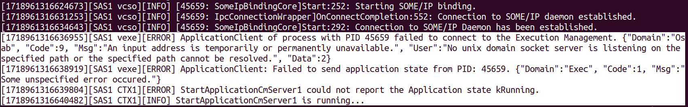
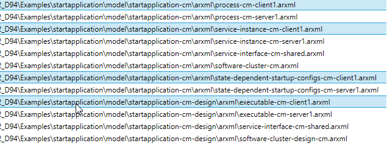
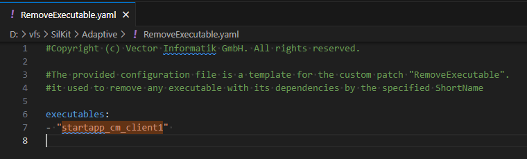
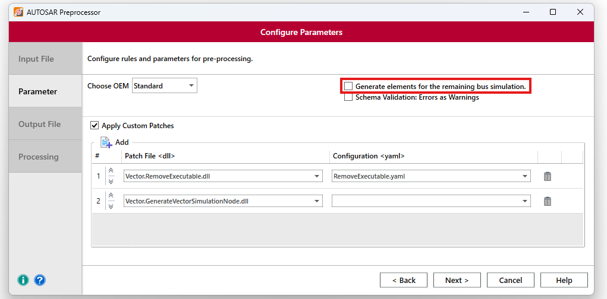
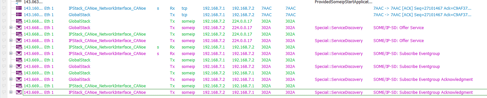
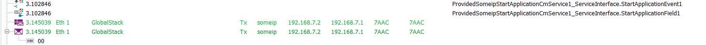
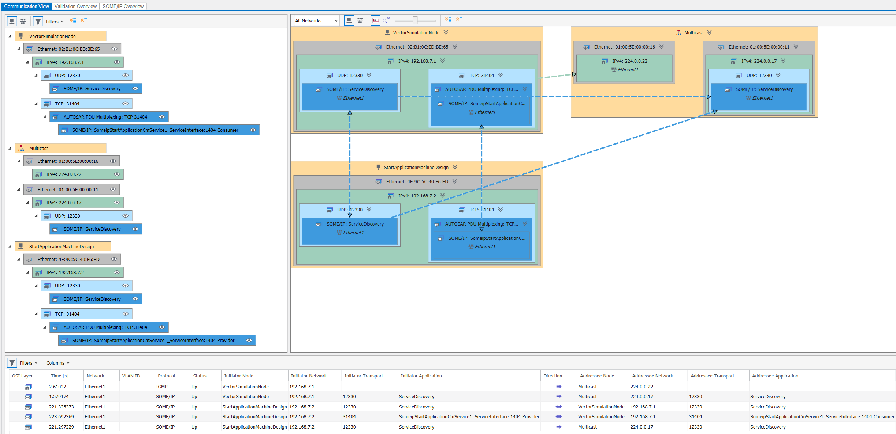

# From MICROSAR Adaptive delivery to simulation with CANoe

This document will guide you on how to use CANoe as a test tool for an Adaptive application, that is built based on a MICROSAR Adaptive BSW Package. A MICROSAR Adaptive delivery contains some examples. We will use one of these examples that is called *start application*. Connect it to CANoe and simulate parts of it with its toolbox. These instructions are written based on an Adaptive MICROSAR stack version r8.00.02 (D94) interacting with CANoe 18 and CANoe 19. With every newer release of the Adaptive stack or CANoe, there might be deviations from this guide, though it shall be possible to adapt the commands with the user guides provided with the tools.  
The *start application* contains one Adaptive machine with multiple executables. It does not realize an automotive user story, but uses all relevant parts of an Adaptive application with comprehensive names. It consists of several use cases. In this guide, we will focus on the Communication Management use case (StartApplicationCmClient1 and StartApplicationCmServer1).

It relies on the SomeIP Daemon that is part of the delivery. Communication in between the executables is realized with SomeIP and IPC. The original *start application* may use the execution manager and also contains some python scripts to trigger the single executables.
This guide is based on the usage of a VM with Ubuntu 22.04. We will use the Linux VM for building the stack including the *start application* example and for running the Adaptive executables. Any other virtualization platform may be used as long as it is suitable to build the Adaptive stack and the SIL Kit components. 

CANoe will connect to the VM via Vector SIL Kit as a SIL Kit participant. The counterpart running on the VM is the SIL Kit Adapter TAP which connects as another participant to the SIL Kit network as well.

## Build the Adaptive MICROSAR stack and the *start application*

After decrypting and unpacking the Adaptive delivery, use the ``Doc/UserManuals/InstallationGuide_MICROSARAdaptive.pdf`` manual to get the latest requirements and instructions to set up your Linux system and then to build and install all the components of the stack. You can omit the sections for Yocto Linux and QNX.

The *start application* is part of the delivery at ``Examples/startapplication``. It comes with its own user manual ``Doc/UserManuals/UserManual_StartApplication.pdf``. Besides a description of all single components of the *start application*, it contains instructions on how to build and install the *start application* with TACO. Follow these instructions and end after the section *Install Runtime*. We don't need to execute the build script. And we won't create a network adapter for the *start application* as the next step of the user guide suggests, since we want to connect it to CANoe via the SIL Kit Adapter TAP.

**Hint:** If you want to get rid of the non-fatal errors and warnings due to the missing execution manger you can disable its usage in the CMakeLists.txt of the *start application* by setting ``AMSR_ENABLE_EXEC_MANAGER`` to ``OFF``.

## Obtain the Vector SIL Kit components

Download a preview or release of the adapter directly from [Vector SIL Kit Adapter TAP Releases](https://github.com/vectorgrp/sil-kit-adapters-tap/releases) or build the Vector SIL Kit Adapter TAP [on your own](https://github.com/vectorgrp/sil-kit-adapters-tap#a-getting-started-with-self-built-adapter-and-demos).

For both options you need a sil-kit-registry contained in the SIL Kit Release, which you can download directly from [Vector SIL Kit Releases](https://github.com/vectorgrp/sil-kit/releases).

## Start the sil-kit-registry

Before you start the adapter there always needs to be a sil-kit-registry running. The easiest way is to start it like this in your Linux system:

```bash
/path/to/SilKit-x.y.z-$ubuntu/SilKit/bin/sil-kit-registry --listen-uri 'silkit://0.0.0.0:8501'
```

We recommend using a designated URI (e.g. "0.0.0.0:8501") to avoid issues with reachability and the execution sequence when using the default setting (localhost).


## Setup the SIL Kit Adapter TAP with the SUT

In this section, you will find an overview of the setup and step-by-step instructions to attach the SIL Kit Adapter TAP to the Adaptive *start application*. Alternatively there is also a [helper-script](helper-scripts/start_app_sil_kit_adapters_setup.sh) which can be seen as a template automating all these steps.

### Overview
This sketch shows the components of our setup and how they are connected:

    +-----------------------------------------+
    |                                         |
    |               Server                    |
    |           IP 192.168.7.2                |
    |             Port:31404                  |
    |                                         |
    +-----------------------------------------+
                      <=>
       sikit_tap as network endpoint in NetNs
                      <=>
    +--[ SomeIP and Crypto Daemon in NetNs ]--+                                +------[ SIL Kit Adapter TAP ]------+
    |        silkit_tap added to NetNs        | <= ------ silkit_tap ------ => |    TapConnection to silkit_tap    |
    |     <=> Server Com via SomeIP Daemon    |                                |  <=> virtual (SIL Kit) Ethernet1  |
    +-----------------------------------------+                                +-----------------------------------+
                                                                                               <=>
                                                                                             SIL Kit
                                                                                               <=>                 
    +-------------[ Vector CANoe ]------------+                                +-------[ SIL Kit Registry ]--------+
    |                                         | <= ------- SIL Kit -------- => |                                   |
    |                  Client                 |                                |                                   |
    |              IP 192.168.7.1             |                                |                                   |
    |                Port:31404               |                                |                                   |
    |                                         |                                |                                   |
    +-----------------------------------------+                                +-----------------------------------+


### Setting up the network and starting the adapter

The user manual of the *start application* suggests to create a network adapter with the IP address 192.168.7.2, we omitted this step and will now create a TAP device in the Linux system with the same address. The TAP device will enable the connection with CANoe using the Vector SIL Kit Adapter TAP. The TAP device is put in an extra namespace to separate the traffic completely. The Vector SIL Kit Adapter TAP needs to run before moving the TAP device to the network namespace. Finally the SomeIP Daemon has to be started in context of this namespace. It is a good idea to put all the necessary commands in a shell script and also extend it with some commands to kill the applications from a previous run (see [helper-script](helper-scripts/start_app_sil_kit_adapters_setup.sh) as a possible template).

1. Create TAP device `silkit_tap`

    ```bash
    sudo ip tuntap add dev silkit_tap mode tap
    ```

2. Start the Vector SIL Kit Adapter TAP and set the network name to the same one that will be used by CANoe.

    ```bash
    /path/to/sil-kit-adapters-tap/bin/sil-kit-adapter-tap --network 'Ethernet1'
    ```
    
   The sil-kit-registry will announce a connected participant:
   
     ```bash
     [date time] [SilKitRegistry] [info] Sending known participant message to EthernetTapDevice
     ```

3. Move the TAP device "silkit_tap" to the network namespace "tap_demo_ns"

    ```bash
    sudo ip netns add tap_demo_ns
    sudo ip link set silkit_tap netns tap_demo_ns
    ```

4. Configure the TAP device "silkit_tap" to the IP address used by the Adaptive application. The server StartApplicationCmServer1 of the *start application* e.g. uses the network endpoint 192.168.7.2.

    ```bash
    sudo ip -netns tap_demo_ns addr add 192.168.7.2/16 dev silkit_tap
    sudo ip -netns tap_demo_ns link set silkit_tap up
    ```

5. To avoid integrity check issues with development states of the SUT it should be disabled:
    
    ```bash    
    export AMSR_DISABLE_INTEGRITY_CHECK=1
    ```

    **Hint:** This export needs to be done in every terminal environment where an executable from the *start application* is started. This also applies to the crypto and SOME/IP daemon.

6. The crypto daemon may be started in the designated network namespace at this point. Starting the crypto daemon could look like this, just replace ``$INSTALL_PATH_CRYPTO_DAEMON`` with the suitable path (e.g. ``$AMSR_SRC_DIR``/Examples/startapplication/build/gcc7_linux_x86_64/install/opt/amsr_crypto_daemon):

    ```bash
    cd ${INSTALL_PATH_CRYPTO_DAEMON}
    sudo -E nsenter --net=/var/run/netns/tap_demo_ns ./bin/amsr_crypto_daemon
    ```

7. The SOME/IP daemon may be started in the designated network namespace at this point. A configuration file for this daemon is needed. Starting the SOME/IP daemon with a config could look like this, just replace ``$INSTALL_PATH_SOMEIPD_POSIX`` with the suitable path (e.g ``$AMSR_SRC_DIR``/Examples/startapplication/build/gcc7_linux_x86_64/install/opt/amsr_someipd_daemon):

    ```bash
    cd ${INSTALL_PATH_SOMEIPD_POSIX}
    sudo -E nsenter --net=/var/run/netns/tap_demo_ns ./bin/amsr_someipd_daemon -c ./etc/someipd-posix.json
    ```

### Start the server application

At this point, the server executable can be started in the Linux system. For the example, it is not necessary to use the Execution Manager and it is enough to start the `startapp_cm_server1`. The executable provides the StartApplicationService1 service and the SOME/IP Daemon will dispatch it. The `StartApplicationMethod1` method will increment the received value by 1, set the `StartApplicationEvent1` and update the `StartApplicationField1`.

  ```bash
  cd ${AMSR_SRC_DIR}/Examples/startapplication/build/gcc7_linux_x86_64/install/opt/startapp_cm_server1/
  ./bin/startapp_cm_server1
  ```

**Hint:** It is totally fine to see error messages like shown below, as long as you got the feedback that the actual application you just started is running. The error message are shown due to the fact that we don't use the execution manager for this demo.



## Setup CANoe (CANoe 18 and newer) as a client tester and SIL Kit participant
Finally it is time to setup a CANoe configuration as a SIL Kit participant which serves as a client mockup for our server application under test.

You have to leave out the information which belong to the client executable when using the AUTOSAR Preprocessor in CANoe to merge the system descriptions. Otherwise the client mockup can not be created. There are two common options to achieve this.

**Option 1:** This option works for all recent CANoe and AUTOSAR Preprocessor versions. You just have to leave out the arxml files which contain the information of the executable you want to have covered by CANoe. In this particular demo the following selected files have to be omitted:



**Option 2:** With CANoe 19 and newer (including AUTOSAR preprocessor version >= 11.0.33) alternatively executables can be removed via their short name in an arxml file with the `RemoveExecutablePatch` applied as a Custom Patch. The default paths are `C:\Program Files\Vector AUTOSAR Preprocessor\CustomPatches\Vector\R20-11\RemoveExecutable\Vector.RemoveExecutable.dll` and `C:\ProgramData\Vector\AUTOSAR Preprocessor\Vector\R20-11\RemoveExecutable\RemoveExecutableTemplate.yaml`.

Specify the executable you want to remove, such as `startapp_cm_client1`, in the `RemoveExecutablePatch` yaml file (see template yaml file) as follows:



In the AUTOSAR Preprocessor `RemoveExecutablePatch` and `Vector.GenerateVectorSimulationNode` must be added as custom patches to remove the specified executables and generate the necessary elements for the remaining bus simulation. Be aware that you have to deselect the default generation of elements for the remaining bus simulation:



### CANoe Simulation Setup
The step-by-step instructions in [this section](readme-sub-sections/interaction_with_CANoe_and_DOs.md) showcase what has to be done to setup the CANoe Simulation Setup.

### CANoe SIL Kit configuration steps
The step-by-step instructions in [this section](readme-sub-sections/interaction_with_CANoe_and_SIL_Kit.md) showcase what has to be done to setup CANoe as a SIL Kit participant.

### Start the simulation in CANoe

Start the simulation in CANoe. The sil-kit-registry will announce a new participant:

    [date time] [SilKitRegistry] [info] Sending known participant message to CANoe

In the CANoe trace window you can see the services periodically being offered by the server running in the Linux system and the subscription of the services:



Executing the test in CANoe shows the communication between CANoe and the server running on the Linux system over Ethernet:



The CANoe Protocol Monitor will give you a good overview of the involved participants, the multicast phase of the service discovery and the actual SOME/IP communication:


