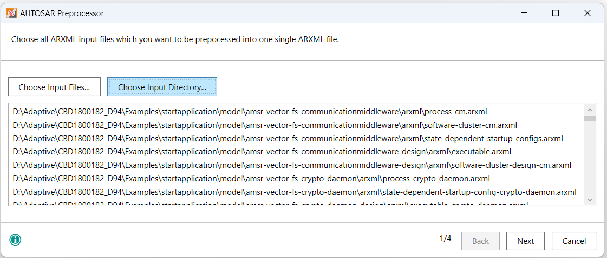
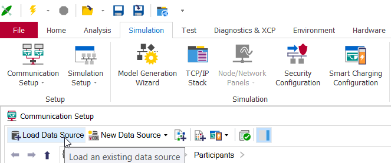
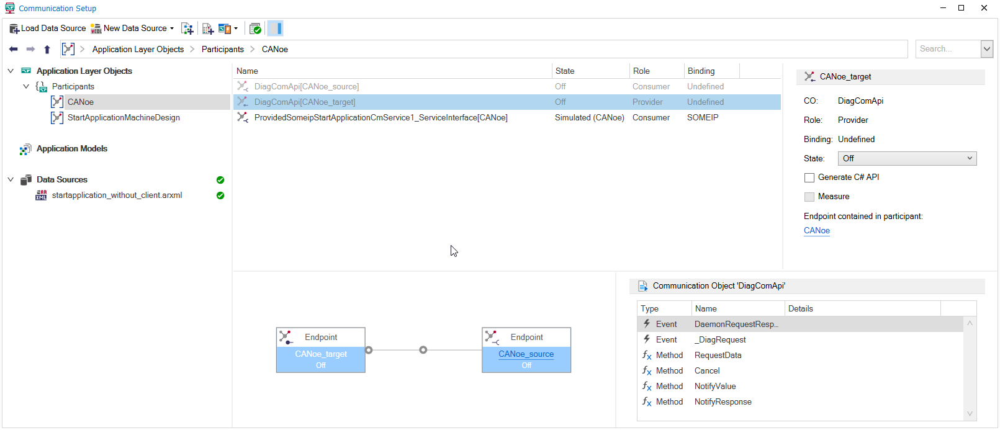
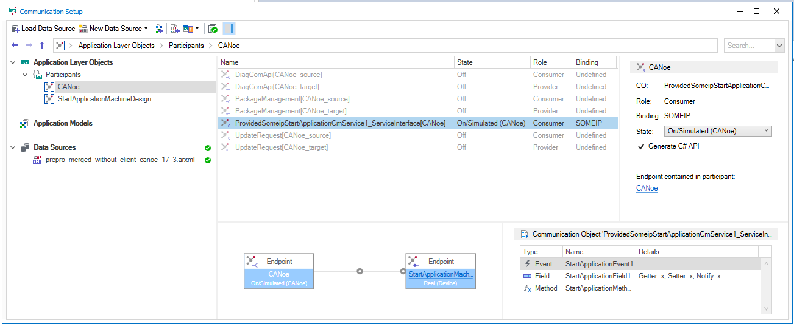
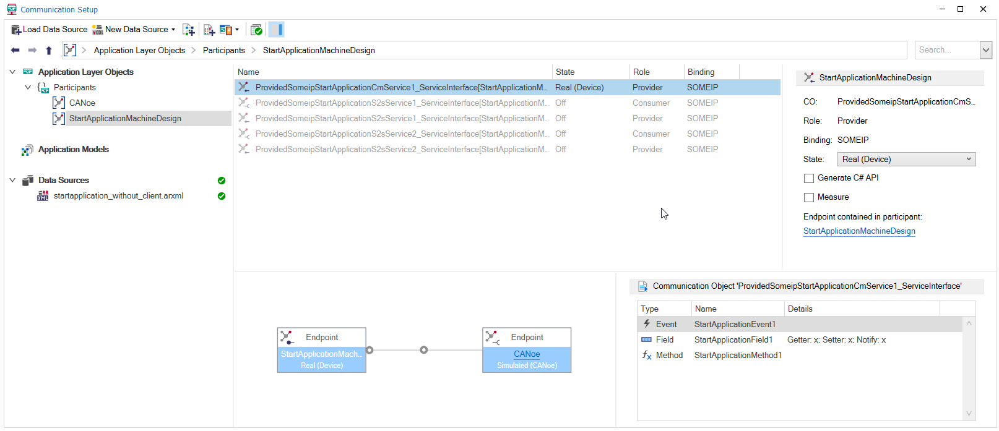

## Create CANoe configuration (CANoe 17 and newer)

Create a new CANoe configuration based on the template `Ethernet (Communication Setup)`.  

An Adaptive application usually has multiple ARXML files, the CANoe AUTOSAR Preprocessor allows you to merge these ARXML files. You can start it from the CANoe `Tools` ribbon.

With the option `Choose Input Directory...` you can select the whole *model* folder of the *start application*. In that case be aware to delete the client .arxml files for this demo use case as mentioned [here](../README.md#setup-canoe-as-a-client-tester-and-sil-kit-participant).



The combined system descriptions (ARXML) can be added in the Communication Setup (`Communication Setup -> Load Data Source`). This will configure the network setup and generate communication objects, allowing you to test the available services.



### Testing the server - CANoe as client

In this demo we run the server executable in the Linux system and use CANoe as a client.
CANoe will derive a participant as application layer object for the executable defined in the combined ARXML. This participant builds the server, which is executed on the Linux system as real device. It consists of multiple communication objects; a communication object will be derived for every service interface and allows accessing events, fields, methods and PDUs. As CANoe will build the counterpart to the real device, automatically another application layer participant `CANoe` is derived.

Depending on the amount of ARXMLs that were added and their contained service interfaces, additional communication objects may have been derived.  

- Set the state of communication objects that are not needed for the moment, e.g. the Diagnostic Service Interface, to `Off`.
- Set the state of the participant CANoe to `On/Simulated (CANoe)` and enable to generate the C# API, since we will write a C# test.  
- The state of the participant running in the Linux system shall be set to `Real (Device)` - in our example this is the participant ``StartApplicationMachineDesign``.

You may need to press the `Publish` button to make the changes available e.g. in the Symbol Explorer.






     

The following test checks the availability of the service provided by the server application and tests if the *StartApplicationMethod1* works correctly. You can add it to the CANoe Test Setup and run it after [starting the simulation](../README.md#canoe-common-sil-kit-configuration-steps).

```csharp
  [TestCase("TestClientMethod")]
  private void TestClientMethod()
  {
    Report.TestCaseDescription("Check valid operation of service method \"Add\"");
    
    for(uint number = 201; number < 204; number++)
    {
      Report.TestStep("INVOKE_METHOD", "Transmit request to server provider: StartApplicationMethod1" + number.ToString());
      DataTypes.StartApplicationMethod1_prototype_Base.CallContext call_handle;
      call_handle = NetworkDB.ProvidedSomeipStartApplicationCmService1_ServiceInterface.consumerSide.StartApplicationMethod1.CallAsync(number);
      // Wait until result received or timeout
      if (Execution.WaitForAnswer(call_handle, 10000).WaitResult == 1)
      {
        Report.TestStepPass("CHECK_RESULT", "Received response from server");
        uint received_value = call_handle.output_argument;
        uint expected_value = number + 1;
        // Compare received result to expected value
        if (received_value == expected_value)
        {
          Report.TestStepPass("CHECK_RESULT", "Expected return value received: " + call_handle.output_argument.ToString());
        }
        //[...]
      }
      else
      {
        Report.TestStepFail("TestCase timed out.");
      }
    }
  }
```
Continue with the [common steps](../README.md#canoe-common-sil-kit-configuration-steps).