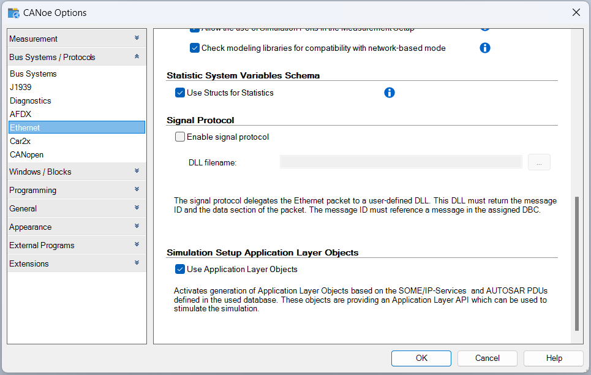
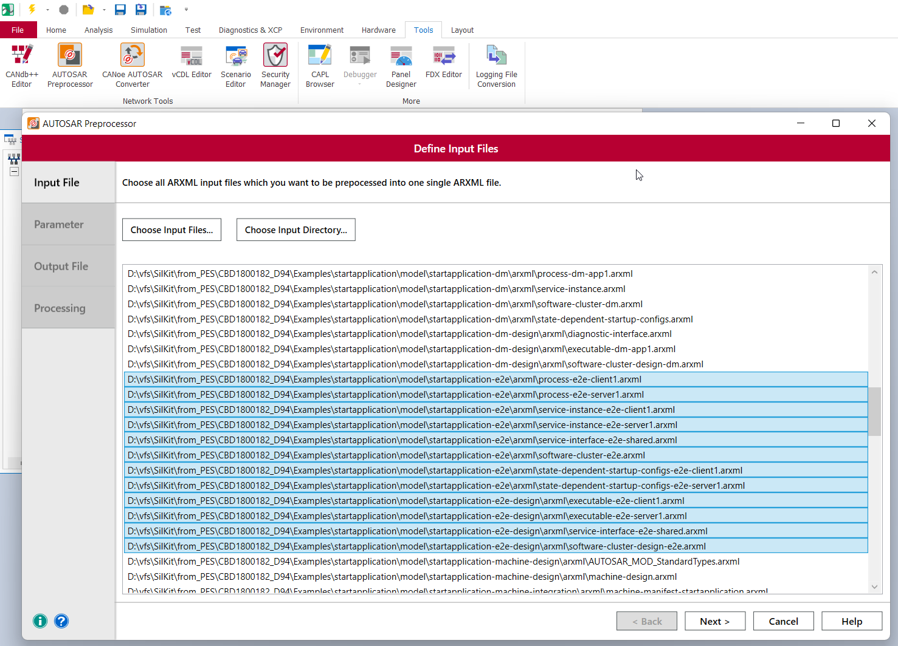
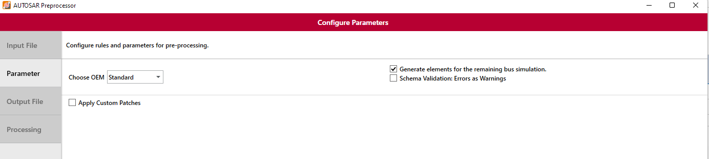
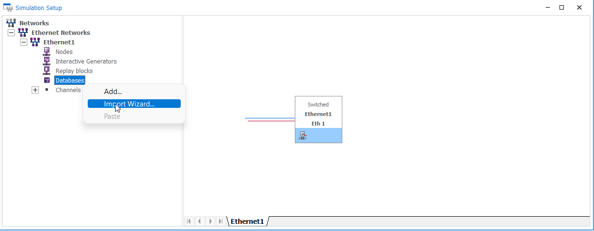
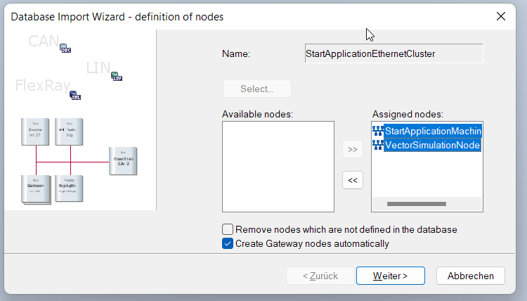
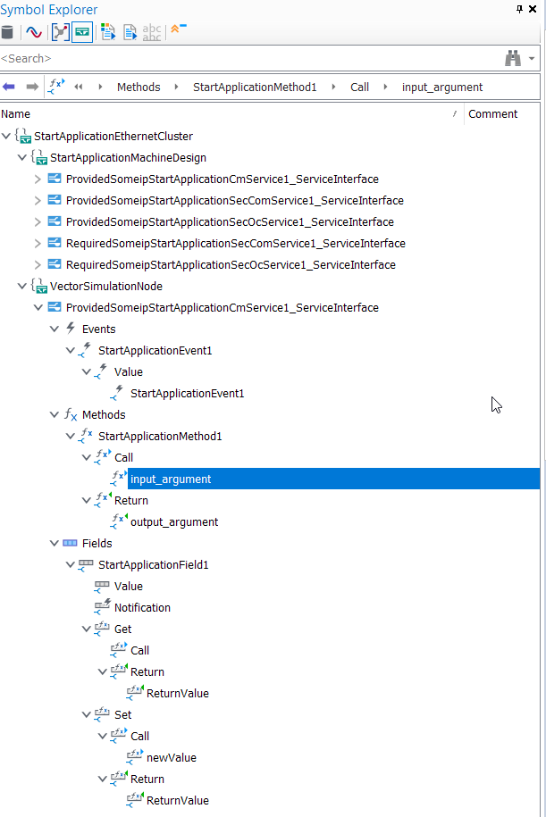
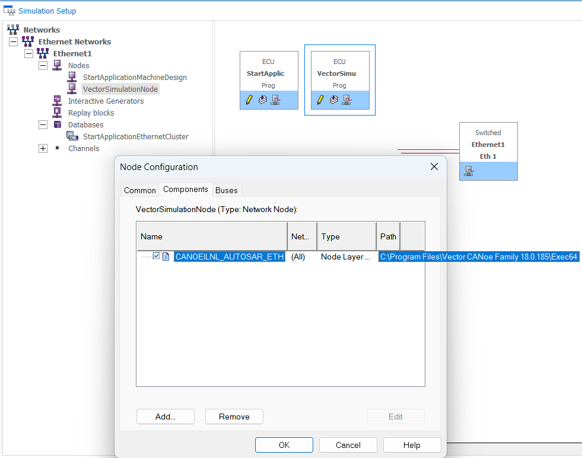

## Create CANoe configuration (CANoe 18 and newer)

Create a new CANoe configuration based on the template `Ethernet (Application Objects)`.

**Hint (optional):** If you do not want or can not use the template mentioned above you can also activate the new workflow for an existing configuration with the *Simulation Setup Application Layer Objects* option:



An Adaptive application usually has multiple ARXML files, the CANoe AUTOSAR Preprocessor allows you to merge these ARXML files. It is a separate tool installed together with CANoe. You can start it from the Windows start menu or from the CANoe `Tools` ribbon.

With the option `Choose Input Directory...` you can select the whole *model* folder of the *start application*. In that case be aware to delete the client .arxml files for this demo use case as mentioned [here](../README.md#setup-canoe-as-a-client-tester-and-sil-kit-participant).

**Hint:** There is an known issue with the combination of the *start application* e2e use case from version D94 and the CANoe 18 database import. We don't need this use case for this demo. Therefore delete the selected files as well to avoid any issues:



Leave the settings in the AUTOSAR Preprocessor at their default values:



The combined system descriptions (ARXML) can be added to the simulation setup via the *Databases Import Wizard*:



Use the `Select...` button to choose the file, assign both available nodes and complete the wizard process:



This will configure the network setup and generate distributed objects, allowing you to test the available services. You will get an overview about the generated distributed objects and derived participants in the *Symbol Explorer*. The ones derived for the client mockup of CANoe which can be used for testing can be found in *VectorSimulationNode*:



You also need to add *CANoeILNL_AUTOSAR_Eth.vmodule* to the *Components* of the *VectorSimulationNode*. This can be done in the *Node Configuration* which you can access via the context menu of the the *VectorSimulationNode* with the entry *Configuration...*. The .vmodule file itself can be found in your CANoe installation folder:



### Testing the server - CANoe as client

In this demo we run the server executable in the Linux system and use CANoe as a client. Letting CANoe act as a client can be done by accessing the derived distributed objects with the automatically generated C# API.

A first test could consist of checking the availability of the service provided by the server application and test if the *StartApplicationMethod1* works correctly:

```csharp
  [TestCase("TestClientMethod")]
  private void TestClientMethod()
  {
      Report.TestCaseDescription("Check valid operation of service method \"Add\"");

      for (uint number = 201; number < 204; number++)
      {
          Report.TestStep("INVOKE_METHOD", "Transmit request to server provider: StartApplicationMethod1" + number.ToString());
          var call_handle = StartApplicationEthernetCluster.VectorSimulationNode.ProvidedSomeipStartApplicationCmService1_ServiceInterface.StartApplicationMethod1.CallAsync(number);
          // Wait until result received or timeout
          if (Execution.WaitForAnswer(call_handle, 10000).WaitResult == 1)
          {
              Report.TestStepPass("CHECK_RESULT", "Received response from server");
              uint received_value = call_handle.output_argument;
              uint expected_value = number + 1;
              // Compare received result to expected value
              if (received_value == expected_value)
              {
                  Report.TestStepPass("CHECK_RESULT", "Expected return value received: " + call_handle.output_argument.ToString());
              }
              //[...]
          }
          else
          {
              Report.TestStepFail("TestCase timed out.");
          }

      }
  }
```

Continue with the [common steps](../README.md#canoe-common-sil-kit-configuration-steps).


