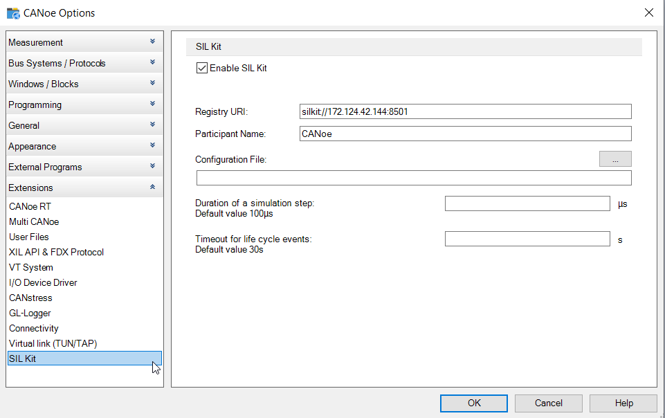
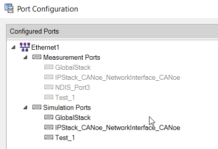
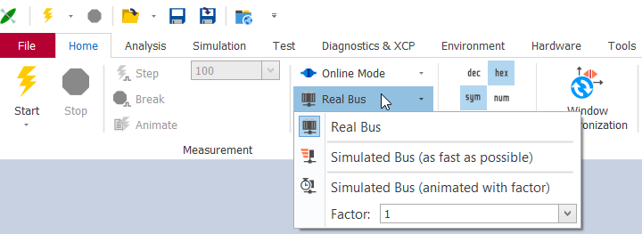
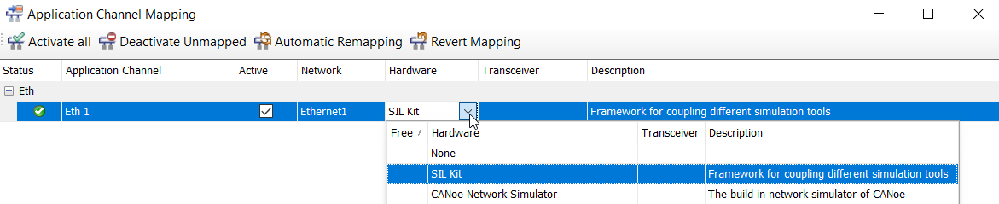

## Configuration of SIL Kit

Enable SIL Kit in CANoe by entering the global: `Options -> Extensions -> SIL Kit -> Enable SIL Kit`.

1. **Registry URI**: Set the IP address and port to the values of the system where the sil-kit-registry is running. In our example we run the sil-kit-registry on the Linux system, where the Adaptive application is executed.

2. **Participant Name**: This name is the identifier of CANoe in the context of SIL Kit communication.  

3. **Configuration File**: For our first example the name of the network in CANoe ("Ethernet1") equals the name of the SIL Kit network that is passed to the Vector SIL Kit Adapter TAP. Therefore we do not need to specify a configuration file because both participants will be in the same SIL Kit network by default.

      

## Advanced configuration of SIL Kit (optional)

To use a custom network for the interaction, create a new YAML file containing the configuration of the SIL Kit for CANoe.

In this file, the option "EthernetControllers" with the attributes "Name" and "Network" needs to be defined:

```YAML
Description: Configuration for CANoe participant
EthernetControllers:
- Name: "Ethernet1/IPStack_CANoe_NetworkInterface_CANoe"
  Network: "silkit_network"
```

**Important**: The "Name" of the "EthernetControllers" in the YAML file must match the pattern "CANoeEthNetworkName/CANoeSimulationPortName". The value given at "Network" needs to match the network name which has been set for Vector SIL Kit Adapter TAP as well. To check the names of the Simulation Ports in CANoe, go to the `Hardware` tab and select `Port Configuration`:



## SIL Kit Channel Mapping

In a last configuration step, the simulation and channel settings need to be adapted in CANoe. First change the simulation mode to `Real Bus`.

  

Now switch to the `Hardware` tab and click on `Channel Mapping`. In this window one Ethernet channel should be shown. In the dropdown menu for the option `Hardware` set the value to `SIL Kit`.

  

After you changed the mapping you can switch back to `Simulated Bus (animated with factor=1)` again.
